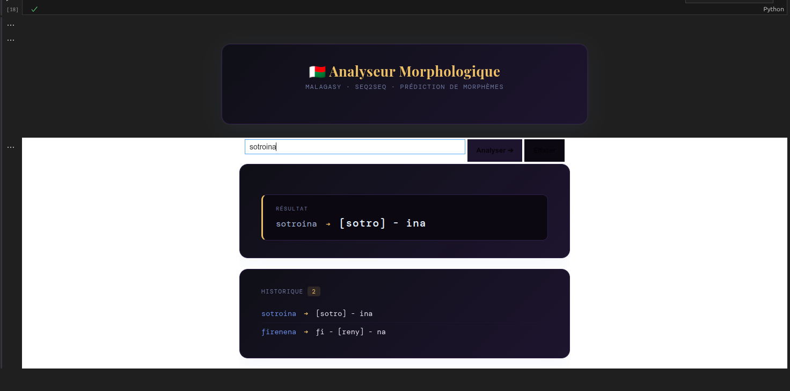
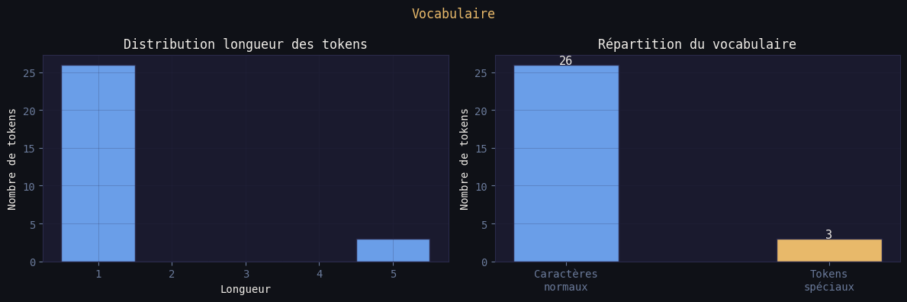
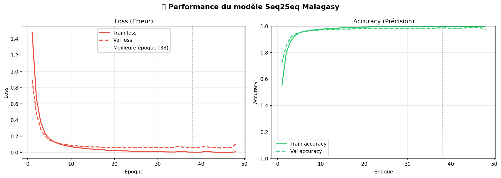

# 🇲🇬 Malagasy Morpheme Segmentation — DataML

> **Projet de NLP** pour la segmentation morphologique et l'identification de racines en langue malgache, combinant scraping de données et apprentissage profond.

---

## 📁 Structure du Projet

```
DataML/
├── scraping/          ← Collecte et préparation des données
└── lemmnation/        ← Modèle de segmentation morphologique (Seq2Seq)
```

| Dossier | Rôle | Technologies |
|---|---|---|
| [`📂 scraping/`](./scraping/README.md) | Web scraping des racines malgaches, construction du dataset d'entraînement | Python, BeautifulSoup, Pandas |
| [`📂 lemmnation/`](./lemmnation/README.md) | Modèle Seq2Seq pour segmenter les mots en morphèmes et identifier la racine | TensorFlow, Keras, LSTM |

---

## 🔄 Pipeline Global

```
┌─────────────────────────────────────────────────────────────────┐
│                        PIPELINE NLP                             │
├──────────────┬──────────────────┬──────────────────────────────┤
│   ÉTAPE 1    │     ÉTAPE 2      │          ÉTAPE 3             │
│  (scraping/) │   (scraping/)    │       (lemmnation/)          │
│              │                  │                              │
│  Scraping    │  Construction    │  Entraînement du modèle      │
│  du site web │  du dataset      │  Seq2Seq + Inférence         │
│  tenymalagasy│  d'entraînement  │                              │
└──────────────┴──────────────────┴──────────────────────────────┘
         ↓                ↓                    ↓
   racines.json    training_data.csv    model.keras + predict()
```

---

## 🚀 Démarrage Rapide

### 1. Cloner le projet

```bash
git clone <url-du-repo>
cd DataML
```

### 2. Installer les dépendances

```bash
pip install -r scraping/requirements.txt
```

### 3. Lancer Jupyter

```bash
cd lemmnation
jupyter notebook
```

> ⚠️ **GPU recommandé** — Voir [`lemmnation/README.md`](./lemmnation/README.md) pour la configuration GPU.

---

## 📊 Résultats

| Métrique | Valeur |
|---|---|
| Val Accuracy (meilleure) | **~98.6%** |
| Meilleure époque | **38 / 50** |
| Architecture | LSTM Seq2Seq (668K paramètres) |
| Taille du vocabulaire | **29 tokens** (26 caractères + 3 spéciaux) |

---

## 📈 Aperçu et Performances

### 1. Segmentation en Action (Demo)
Le modèle est capable de segmenter des mots complexes tout en isolant la racine entre crochets.


### 2. Statistiques du Vocabulaire
Nous avons scrapé plus de **40 000 mots** avec leurs **règles grammaticales** respectives, créant ainsi une base solide pour l'apprentissage.
avec


### 3. Courbes d'Apprentissage
L'entraînement sur GPU a permis d'atteindre une précision de **98.76%** rapidement.


---

## 🔗 Dossiers — Cliquez pour les détails

- **[📂 scraping/](./scraping/README.md)** — Scraping des racines malgaches depuis tenymalagasy.org
- **[📂 lemmnation/](./lemmnation/README.md)** — Modèle de segmentation morphologique Seq2Seq
