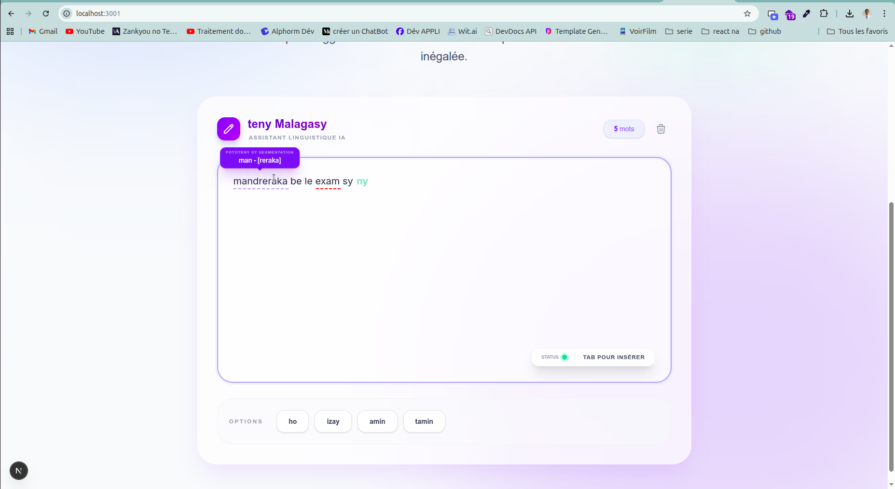
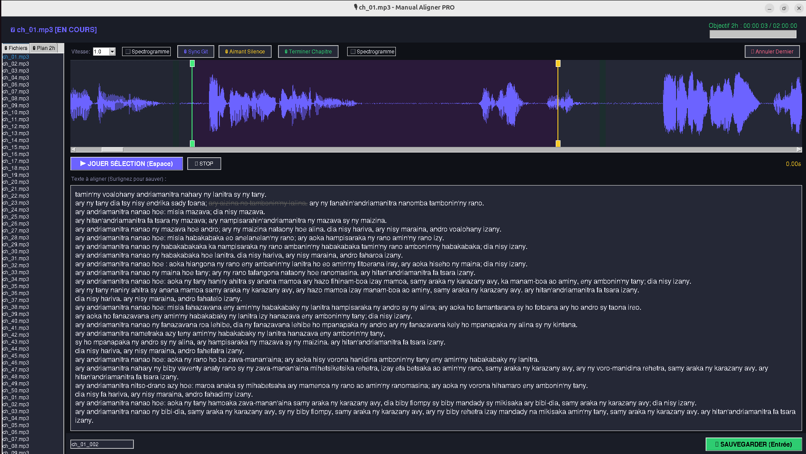
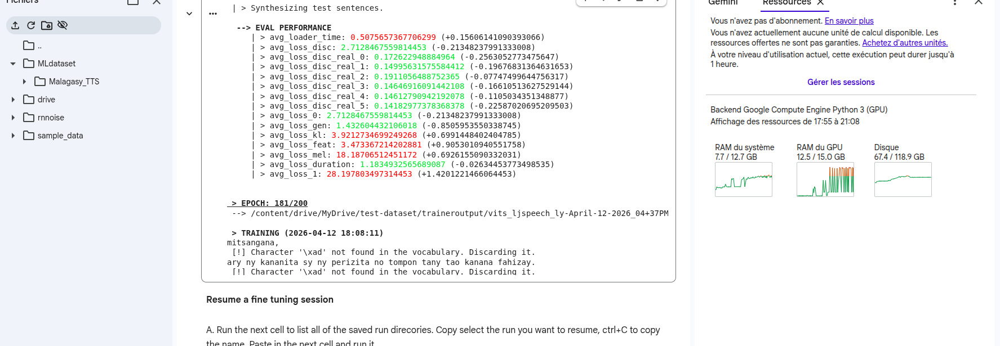
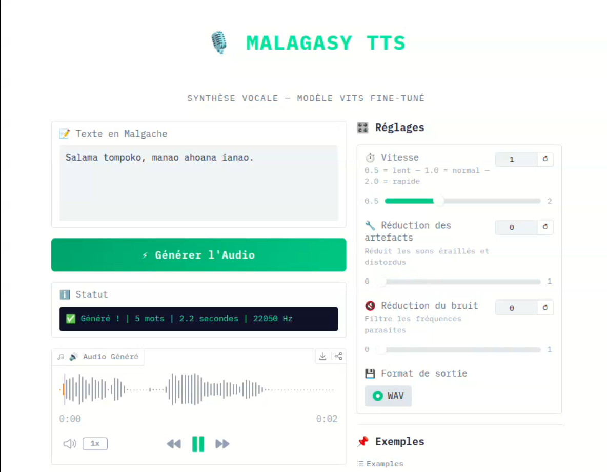

# Projet ISAIA 5 – Traitement Automatique du Malgache

[](LICENSE)  
[](https://www.python.org/)

## Description

Ce projet vise à développer des outils de traitement automatique du malgache, incluant :

- Correction orthographique  
- Vérification des règles de base  
- Lemmatisation (avec modèle encodeur-décodeur)  
- Autocomplétion (méthode markovienne)  

Les données sont extraites du site [tenymalagasy.org](https://tenymalagasy.org).

---

## Membres du groupe

| N°  | Nom | Rôle |
|-----|-----|------|
| 09  | **TOVO Jean Bien Aimé** | Lemmatisation, autocomplétion, scraping des datasets |
| 08  | **RAJOHARIVELO Andriarivony Antenaina** | Développement du frontend |
| 12  | **RAKOTOMAHARAVO Vali Fanomezantsoa** | Vérification des règles à base de regex |
| 02  | **RAHERIMANANA Andriniaina Koloina Mandresy** | Correcteur orthographique |

---

## Fonctionnalités principales

### Correction orthographique
- Scraping des données depuis le site source.  
- Tokenisation et normalisation des entrées.  
- Chargement du dictionnaire malgache.  
- Détection des erreurs et recherche de candidats.  
- Calcul de similarité et sélection du meilleur candidat.  
- Validation, correction et reconstruction des entrées.

### Vérification des règles de base
- Identification de l’alphabet malgache.  
- Définition des règles : lettres interdites, consonnes interdites en fin de mots, combinaisons de consonnes autorisées.  
- Fonction interne pour vérifier les paires de consonnes.  
- Détection des erreurs via des expressions régulières (Regex).

### Lemmatisation
- Scraping du site pour constituer le dataset.  
- Construction du dataset d’entraînement.  
- Entraînement d’un modèle **encodeur-décodeur (Seq2Seq)** pour la lemmatisation.  
- Inférence sur de nouveaux mots.

### Autocomplétion
- Implémentation d’une méthode **markovienne** pour la suggestion de mots ou phrases.

---

# 🇲🇬 Malagasy Morpheme Segmentation — DataML

> **Projet de NLP** pour la segmentation morphologique et l'identification de racines en langue malgache, combinant scraping de données et apprentissage profond.

---

## 📁 Structure du Projet

```
DataML/
├── scraping/           ← Collecte et préparation des données
├── lemmnation/         ← Modèle de segmentation morphologique (Seq2Seq)
├── Backend/            ← API de service (FastAPI)
└── Frontend/           ← Interface utilisateur principale
    └── next-editor/    ← Éditeur de texte intelligent (Next.js)
```

| Dossier | Rôle | Technologies |
|---|---|---|
| [`📂 scraping/`](./scraping/README.md) | Web scraping des racines malgaches, construction du dataset d'entraînement | Python, BeautifulSoup, Pandas |
| [`📂 lemmnation/`](./lemmnation/README.md) | Modèle Seq2Seq pour segmenter les mots en morphèmes et identifier la racine | TensorFlow, Keras, LSTM |
| [`📂 Backend/`](./Backend/README.md) | Serveur d'API pour exposer le modèle Keras et la logique d'orthographe | FastAPI, Uvicorn |
| [`📂 Frontend/next-editor/`](./Frontend/next-editor/README.md) | UI interactive (éditeur intelligent) | Next.js, TypeScript |

---

## 🔄 Pipeline Global

```
┌─────────────────────────────────────────────────────────────────┐
│                        PIPELINE NLP                             │
├──────────────┬──────────────────┬──────────────────────────────┤
│   ÉTAPE 1    │     ÉTAPE 2      │          ÉTAPE 3             │
│  (scraping/) │   (scraping/)    │       (lemmnation/)          │
│              │                  │                              │
│  Scraping    │  Construction    │  Entraînement du modèle      │
│  du site web │  du dataset      │  Seq2Seq + Inférence         │
│  tenymalagasy│  d'entraînement  │                              │
└──────────────┴──────────────────┴──────────────────────────────┘
         ↓                ↓                    ↓
   racines.json    training_data.csv    model.keras + predict()
```

---

## 🚀 Démarrage Rapide

### 1. Configuration du Backend (API)
Le backend gère la lemmatisation, la correction orthographique et les suggestions.
```bash
cd Backend
pip install -r requirements.txt
python main.py
```
*Le backend sera accessible sur `http://localhost:8000`.*

### 2. Configuration du Frontend (Éditeur)
L'interface utilisateur permet de tester l'autocomplétion et l'analyse en temps réel.
```bash
cd Frontend/next-editor
npm install
npm run dev
```
*Le frontend sera disponible sur `http://localhost:3000`.*

### 3. Fonctionnement de l'Éditeur
- **Auto-complétion** : Tapez du texte pour voir des suggestions "fantômes". Appuyez sur **TAB** pour les accepter.
- **Analyse au survol** : Passez la souris sur un mot pour voir sa racine et sa structure segmentée.
- **Vérification orthographique** : Au survol, si le mot ne respecte pas les règles malgaches, il sera souligné en rouge.

> ⚠️ **GPU recommandé** — Voir [`lemmnation/README.md`](./lemmnation/README.md) pour la configuration GPU.

---

## 📊 Résultats

| Métrique | Valeur |
|---|---|
| Val Accuracy (meilleure) | **~98.6%** |
| Meilleure époque | **38 / 50** |
| Architecture | LSTM Seq2Seq (668K paramètres) |
| Taille du vocabulaire | **29 tokens** (26 caractères + 3 spéciaux) |

---

## 📈 Aperçu et Performances

### 1. Segmentation en Action (Demo)
Le modèle est capable de segmenter des mots complexes tout en isolant la racine entre crochets.


### 2. Statistiques du Vocabulaire
Nous avons scrapé plus de **40 000 mots** avec leurs **règles grammaticales** respectives, créant ainsi une base solide pour l'apprentissage.
avec


### 3. Courbes d'Apprentissage
L'entraînement sur GPU a permis d'atteindre une précision de **98.76%** rapidement.


### 1. Demostration (Demo)


---

# 🎙 Malagasy Audio-Text Manual Aligner (PRO)



Station de travail haute performance pour l'alignement manuel de la Bible en Malgache. Optimisée pour la création de jeux de données (datasets) destinés à l'entraînement de modèles de type TTS ou STT.

## ✨ Fonctionnalités Clés
- **Visualisation Double** : Waveform et Spectrogramme interactifs.
- **Smart Seeking** : Estimation automatique des marqueurs audio basée sur le texte sélectionné.
- **Optimisation IA** : Algorithme de sélection des 2 heures les plus riches linguistiquement.
- **Workflow Collaboratif** : Synchronisation légère via Git (partage des métadonnées uniquement).
- **Scripts Utilitaires** : Nettoyage d'audio et reconstruction automatique du dataset.
- **suggestion de piste audio**  : recherche basé sur l'IA pour trouver rapidement le segment audio

## 🧠 Comment fonctionne la suggestion de piste audio ?

L'outil intègre un moteur de recherche basé sur l'IA pour trouver rapidement le segment audio exact correspondant au texte, en combinant la transcription automatique et la comparaison floue de texte.

### 1. Transcription avec OpenAI Whisper
- **Pré-analyse** : Lorsqu'un chapitre audio est chargé, le script (`ia_aligner.py`) fait appel au modèle **Whisper** pour transcrire silencieusement l'intégralité du fichier audio.
- **Segmentation** : Whisper découpe le flux vocal en petits segments, associant chacun à un texte transcrit et des marqueurs de temps (début/fin).
- **Mise en Cache** : Les résultats sont sauvegardés localement de manière transparente, garantissant un chargement quasi instantané lors des ouvertures futures sans re-solliciter le GPU.

### 2. Algorithme de Recherche et Distance de Levenshtein
Lorsque vous interagissez avec une phrase à aligner, le système recherche les meilleurs "candidats" de synchronisation :
- **Fenêtrage glissant** : Le moteur va regrouper différents sous-segments adjacents de Whisper (de 1 jusqu'à 5 segments) pour recréer une phrase ayant une longueur comparable à la cible.
- **Distance de Levenshtein (`rapidfuzz`)** : L'appariement est évalué via la distance de Levenshtein. C'est un algorithme mathématique mesurant l'écart entre deux textes (le nombre minimum d'opérations : insertions, suppressions, substitutions requises pour transformer le texte Whisper imparfait en texte cible). Les légères erreurs de transcription de Whisper n'empêchent donc pas l'outil de donner un score de similarité robuste (via la méthode `fuzz.ratio`).
- **Analyse Contextuelle par Bonus** : Pour parer aux phrases ou mots répétés au sein d'un même chapitre, l'algorithme ne s'arrête pas au texte exact. Il évalue la similarité du **contexte gauche** (phrase précédente) et du **contexte droit** (phrase suivante). Une correspondance de contexte applique un boost proportionnel au score de base.
- **Top 5** : L'outil expurge les résultats se chevauchant dans le temps et vous suggère instantanément les 5 options au score combiné le plus élevé.

[Voir le projet](https://github.com/TovoJB/ManualAligment.git)

## 🎙️ Modèle TTS Malagasy (Fine-tuning VITS)

Ce projet présente un modèle **Text-to-Speech (TTS)** en langue malagasy, entraîné avec des données audio personnalisées en utilisant l’architecture VITS.

---

## 🧠 Entraînement du modèle

Le fine-tuning a été réalisé à l’aide du notebook :

📄 `Finetune_VITS.ipynb`

🖼️ Aperçu du processus d'entraînement :



---

## 🎧 Démo audio

**Texte en entrée :**  
> *"salama tompoko manao ahoana ianao"*

**Sortie générée par le modèle :**  
[🎧 Écouter l’audio](./audio/demo.wav)

🖼️ Exemple de génération :



---

## 🛠️ Technologies utilisées

- Python  
- VITS (Variational Inference Text-to-Speech)  
- PyTorch  


## 🔗 Dossiers — Cliquez pour les détails

- **[📂 scraping/](./scraping/README.md)** — Scraping des racines malgaches depuis tenymalagasy.org
- **[📂 lemmnation/](./lemmnation/README.md)** — Modèle de segmentation morphologique Seq2Seq
- **[📂 Backend/](./Backend/README.md)** — API de service (FastAPI/Flask)
- **[📂 Front/](./Front/README.md)** — Interface utilisateur (React/Vue)
